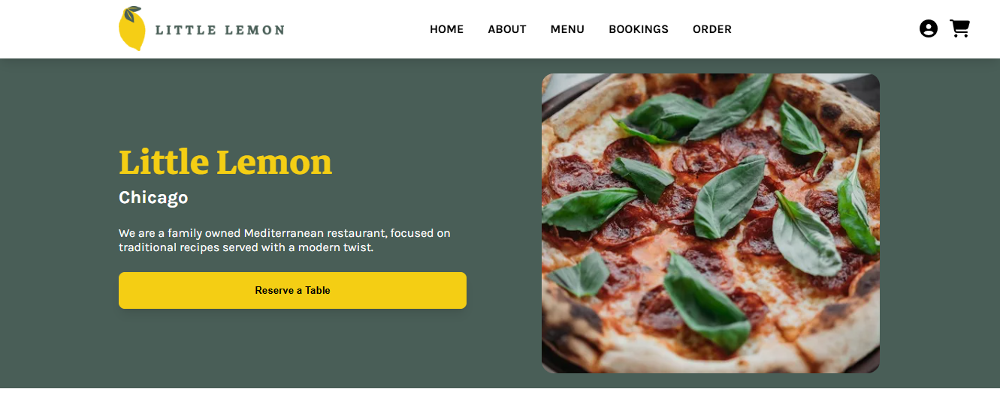
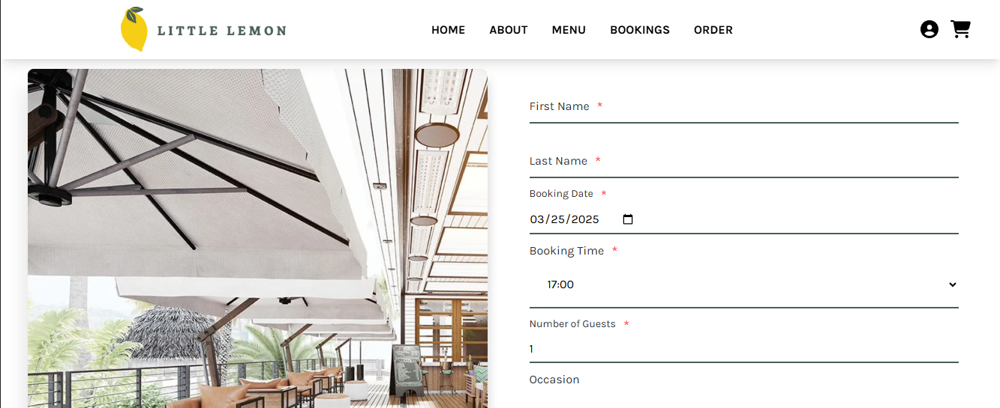
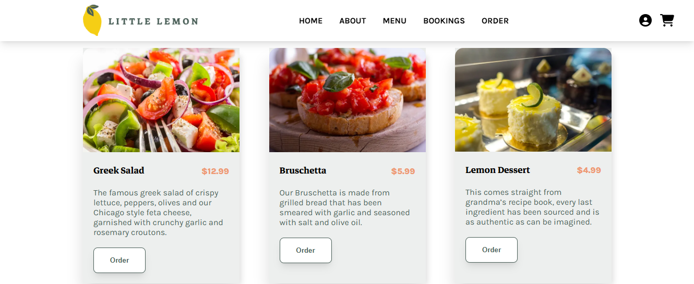
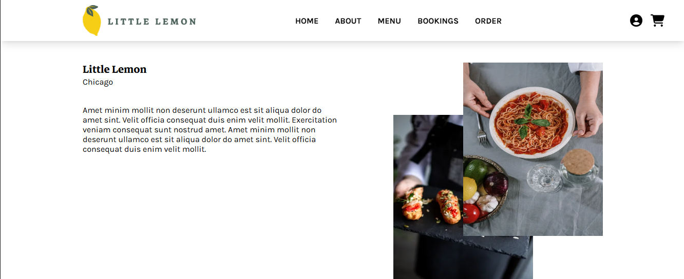

# 🏡 Little Lemon Restaurant - Front-End Capstone Project

**Project:** Meta Front-End Developer Capstone  
**Course:** Meta Front-End Development Professional Certificate  
**Tech Stack:** React, CSS, JavaScript, Vite/CRA, API Integration  

---

## ✨ Project Overview

**Little Lemon** is a Mediterranean restaurant that needed a modern **front-end website** to showcase its menu, reservations, and services. This capstone project focused on:

- ✅ **Building a fully responsive UI** for an intuitive user experience
- ✅ **Implementing booking functionality** for reservations
- ✅ **Enhancing accessibility** and **SEO best practices**
- ✅ **Deploying a production-ready React app**

---
## 🛑 NOTE

- I know the **project's UI looks outdated***, but it was required to be submitted this way.
- The screenshots provide just a small preview of the app—don't judge it before **checking it out**!

---
## ⚙️ Tech Stack & Features

### **⚡ Technologies Used**
- **React.js** – Component-based UI
- **React Router** – Navigation between pages
- **CSS Modules / CCSS** – Styling the application
- **API Integration** – Fetching restaurant data
- **Jest & React Testing Library** – Unit testing

### **🔥 Features**
- ✅ Interactive restaurant menu with categories
- ✅ Online reservation system with date/time selection
- ✅ Fully responsive layout (mobile-first design)
- ✅ SEO-optimized metadata (Open Graph, structured data)
- ✅ Dark mode toggle for better UX

---

## 📷 Screenshot






---

## 🛠 Setup & Installation

### **1️⃣ Clone the Repository**
```bash
git clone https://github.com/your-username/little-lemon-restaurant.git
cd little-lemon-restaurant
```

### **2️⃣ Install Dependencies**
```bash
npm install
```

### **3️⃣ Start the Development Server**
```bash
npm start
```
> Runs at **`http://localhost:3000`**  

---

## 📚 License

This project is for educational purposes as part of the Meta Front-End Developer program.

---

## 📍 Links

- 👉 [Meta Front-End Course](https://www.coursera.org/meta-frontend)  

---

## ✨ Next Steps
- Improve **performance & accessibility**
- Add **backend integration** for real restaurant data
- Implement **user authentication** for returning customers

---

# Credit:

Jayantasamaddar 🫡
https://github.com/jayantasamaddar/